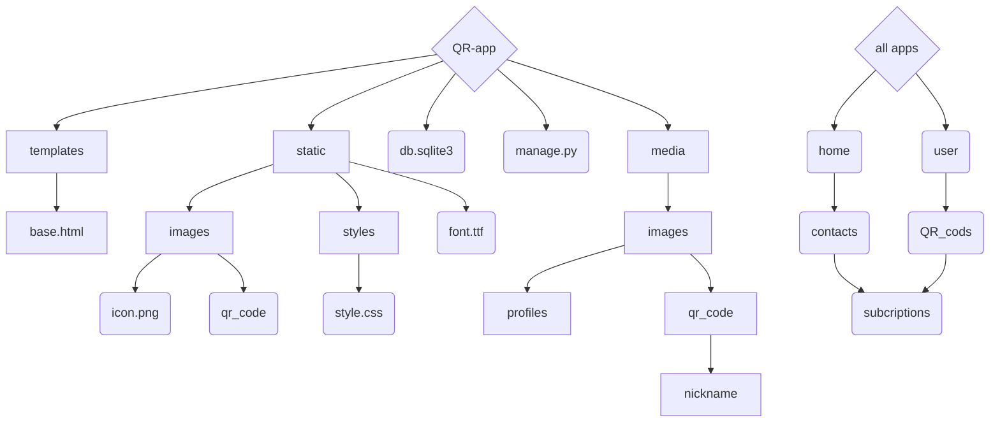
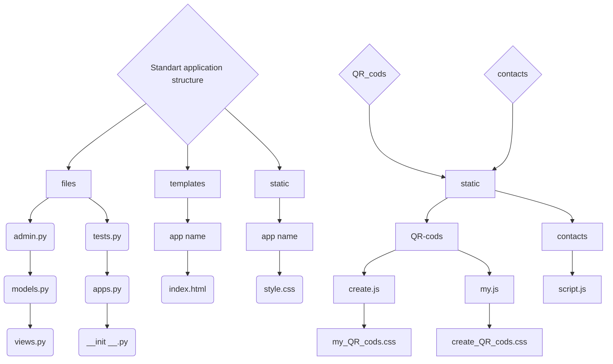

# Сайт для створення Qr кодів / Website for creating Qr codes

<!-- ## Назва проекту: QR приложение / name project: QR app -->

---
### Структура readme:
- [Розробники цього сайту:](#розробники-цього-сайту)
- [Модулі які ми використовували для розробки сайту](#модулі-які-ми-використовували-для-розробки-сайту)
- [Як запустити наш проєкт у роботу](#як-запустити-наш-проєкт-у-роботу)
- [Структура проекту](#структура-проекту--project-sctructure)
- [Структура Приложений](#структура-приложений--apps-sctructure)
- [Описання всіх файлів](#описання-всіх-файлів)
### Organization readme:
- [Developers of this site:](#developers-of-this-site)
- [we used these modules develop the site](#we-used-these-modules-develop-the-site)
- [How to get our project up and running](#how-to-get-our-project-up-and-running)
- [Project-sctructure](#структура-проекту--project-sctructure)
- [Apps sctructure](#структура-приложений--apps-sctructure)
- [Description of all files](#description-of-all-files)
---

## Developers of this site:
* [Illya Epik](https://github.com/IllyaEpik/online_game.git)
* [Mark popovich](https://github.com/markpopovich9/Qr-app)
* [Renat Belei](https://github.com/Renat19Belei/QR-code-generator)
<!-- - [Сайт для створення Qr кодів / Website for creating Qr codes](#сайт-для-створення-qr-кодів--website-for-creating-qr-codes)
    - [Структура readme:](#структура-readme)
  - [Developers of this site:](#developers-of-this-site)
  - [Розробники цього сайту:](#розробники-цього-сайту)
- [Модулі які ми використовували для розробки сайту](#модулі-які-ми-використовували-для-розробки-сайту)
- [we used these modules develop the site](#we-used-these-modules-develop-the-site)
- [Як запустити наш проєкт у роботу](#як-запустити-наш-проєкт-у-роботу)
- [How to get our project up and running](#how-to-get-our-project-up-and-running) -->
## Розробники цього сайту:
<!-- --- -->
* [Ілля Епік](https://github.com/IllyaEpik/online_game.git)
* [Марк Попович](https://github.com/markpopovich9/Qr-app)
* [Ренат БелеЙ](https://github.com/Renat19Belei/QR-code-generator)

---
## Модулі які ми використовували для розробки сайту:
* Модуль Django
* Модуль io
* Модуль base64 
* Модуль qrcode
* Модуль matplotlib
* Модуль os
* Модуль pillow
## we used these modules develop the site:
* Module Django
* Module io
* Module base64
* Module qrcode
* Module matplotlib
* Module os
* Module pillow

---
### Як запустити наш проєкт у роботу:
* Скачайте проєкт с Github

* Відкрийте термінал та переїдіть у папку QR-app
* Активуйте Віртуальне оточення:
  * Windows
    *  Створює віртуальне оточення : `python -m venv venv`
    *  Активує віртуальне оточення: `venv\Scripts\activate.bat`
  * Mac os:
    * Створює віртуальне оточення : `python3 -m venv venv`
    * `cd venv\bin`
    * Активує віртуальне оточення: `source activate`
    * `cd ../..` 

* Пропишіть цю команду щоб встановити всі необхідні модулі: `pip install Django qrcode matplotlib pillow`
* Після того як скачаете всі необхідні модулі, пропишіть у терміналі `python manage.py runserver`

## How to get our project up and running
- Download the project from Github

* Open the terminal and go to the QR-app folder
* Activate the Virtual Environment:
  * Windows
    * Creates a virtual environment: `python -m venv venv`
    * Activates the virtual environment: `venv\Scripts\activate.bat`
  * Mac OS:
    * Creates a virtual environment: `python3 -m venv venv`
    * `cd venv\bin`
    * Activates the virtual environment: `source activate`
    * `cd ../..` 

* Write this command to install all necessary modules: `pip install Django qrcode matplotlib pillow`
* After downloading all the necessary modules, write `python manage.py runserver` or `python3 manage.py runserver` for mac os in the terminal

## Структура проекту / Project sctructure 

## Структура Приложений / apps sctructure 

  <!-- 2  sc -->
  <!-- c  img[images] -->
  <!-- 2  img[images] -->
##

# Описання всіх файлів 
  ### Qr_cods/views.py
  --- У цьому файлі ми створюємо функції відображення Qr-codes(render_create_qr_cods, render_my_qr_cods), а також ми створили функцію для створення Qr-codes (create_qr_code)
  ### Qr_cods/urls.py
  --- У ньому ми створюємо url ссилки для сайтуу
  ### QR_cods/tests.py
  --- Цей файл ми не використовували, але ящо ви плануєте використовували він викорстовується для тестів
  ### QR_cods/models.py
  --- У ньому ми створюємо модель QR_CODE
  ### QR_cods/apps.py
  ---Этот файл определяет конфигурацию приложения и используется Django для его инициализации. Также мы создали класс SubscriptionConfig, этот класс описывает конфигурацию приложения Django.
  ### QR_coda/admin.py
  --- використовується для відображення ваших моделей на панелі адміністратора Django
  ### QR_cods/ __init__.py
  --- Цей файл ми не використовували
  ### QR_cods/templates/create_QR_cods.html
  --- У цьому файлі ми створюємо сторінку Create QR-codes
  ### QR_cods/templates/my_QR_cods.html
  --- У цьому файлі ми створюємо сторінку My QR-code
  ### QR_cods/static/QR-cods/create_QR_cods.css
  --- У цьому файлі ми задаемо вигляду сторінці Create QR-codes
  ### QR_cods/static/QR-cods/create.js
  --- У ньому ми створюємо "логіку" сторінці Create QR-codes
  ### QR_cods/static/QR-cods/my_QR_cods.css
  --- У цьому файлі ми задаемо вигляду сторінці My QR-codes
  ### QR_cods/static/QR-cods/my.js
  --- У ньому ми створюємо "логіку" сторінці My QR-codes
  ### subcriptions/views.py
  --- Цей код містить дві функції відображення view_subscription(request:WSGIRequest):, які відповідають за обробку підписок користувачів, а також ми створили функцію redirection(request: WSGIRequest, qr_id): ця функція виконує перенаправлення корис
  ### subscription/apps.py
  --- This file defines the configuration of the application and is used by Django to initialize it. We also made the SubscriptionConfig class, this class describes the configuration of the Django application
  ### subscription/tests.py
  --- We didn`t use this file, but if you plan to use it, then it is used to made for tests.
  ### subscription/models.py
  --- We didn`t use this file in subcription, but if you plan to use it, then it is used to create models. 
  ### subscription/templates
  --- All HTML templates and page structure are located here.
  ### subscription/static 
  --- All static files, styles for html, and Java script are located here.
  ### subscription/static/script.js
  --- In this file we create the logic for our "Subscribe" page.
  
# Description of all files