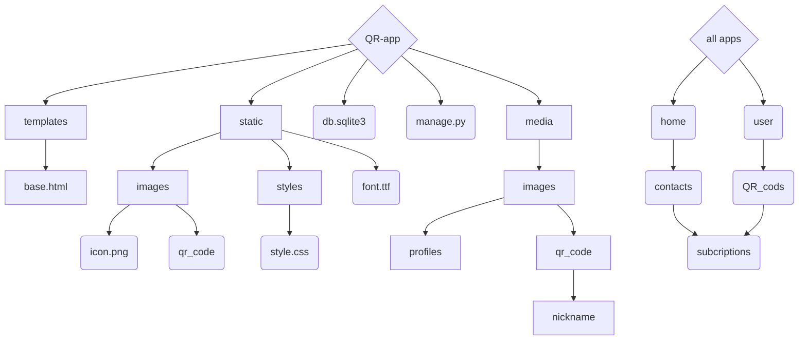
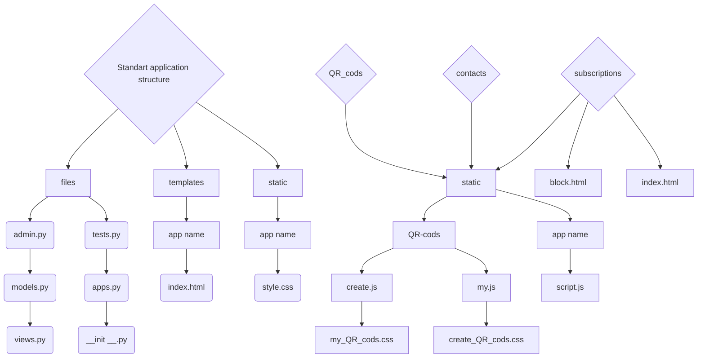

# Сайт для створення Qr кодів / Website for creating Qr codes
---
<!-- ## Назва проекту: QR приложение / name project: QR app -->
## Мета створення проєкту:
 Цей проєкт був створенний для того щоб спростити створення власних QR-кодів для різних потреб користувачів.Він буде корисний як для бізнесу, так і для особистого використання. Завдяки зручному інтерфейсу QR-коди дуже легко створювати, також є багато видів кастомізації.

##  Чим корисний проєкт для користувача?
 Проєкт для створення QR-кодів корисний тим, що спрощує обмін інформацією та підвищує ефективність взаємодії між людьми та бізнесом.
 Завдяки зручному інтефрейсу інтерфейсу QR-коди дуже легко створювати. Також є великий обсяг різної кастомізації.
 Цей проєкт дозволяє швидко, зручно та безпечно передавати інформацію, спрощуючи повсякденні процеси для всіх!

## Purpose of the project:
This project was created to simplify the creation of your own QR codes for various user needs. It will be useful for both business and personal use. Thanks to the user-friendly interface, QR codes are very easy to create, and there are also many types of customization.

## How is the project useful for the user?
The project for creating QR codes is useful because it simplifies the exchange of information and increases the efficiency of interaction between people and businesses.
Thanks to the user-friendly interface, QR codes are very easy to create. There is also a large amount of various customization.
This project allows you to quickly, conveniently and securely transfer information, simplifying everyday processes for everyone!
---
### Структура readme:
- [Розробники цього сайту:](#розробники-цього-сайту)
- [Модулі які ми використовували для розробки сайту](#модулі-які-ми-використовували-для-розробки-сайту)
- [Як запустити наш проєкт у роботу](#як-запустити-наш-проєкт-у-роботу)
- [Структура проекту](#структура-проекту--project-sctructure)
- [Структура Приложений](#структура-приложений--apps-sctructure)
- [Пояснення кожного застосунку](#детальне-пояснення-кожного-застосунку)
- [Описання всіх файлів](#описання-всіх-файлів)
- [Висновок](#висновок)
### Organization readme:
- [Developers of this site:](#developers-of-this-site)
- [we used these modules develop the site](#we-used-these-modules-develop-the-site)
- [How to get our project up and running](#how-to-get-our-project-up-and-running)
- [Project-sctructure](#структура-проекту--project-sctructure)
- [Apps sctructure](#структура-приложений--apps-sctructure)
- [Explanation of each application](#detailed-explanation-of-each-application)
- [Description of all files](#description-of-all-files)
- [Conclusion](#conclusion)
---

## Developers of this site:
* [Illya Epik](https://github.com/IllyaEpik/online_game.git)
* [Mark popovich](https://github.com/markpopovich9/Qr-app)
* [Renat Belei](https://github.com/Renat19Belei/QR-code-generator)
<!-- - [Сайт для створення Qr кодів / Website for creating Qr codes](#сайт-для-створення-qr-кодів--website-for-creating-qr-codes)
    - [Структура readme:](#структура-readme)
  - [Developers of this site:](#developers-of-this-site)
  - [Розробники цього сайту:](#розробники-цього-сайту)
- [Модулі які ми використовували для розробки сайту](#модулі-які-ми-використовували-для-розробки-сайту)
- [we used these modules develop the site](#we-used-these-modules-develop-the-site)
- [Як запустити наш проєкт у роботу](#як-запустити-наш-проєкт-у-роботу)
- [How to get our project up and running](#how-to-get-our-project-up-and-running) -->
## Розробники цього сайту:
<!-- --- -->
* [Ілля Епік](https://github.com/IllyaEpik/online_game.git)
* [Марк Попович](https://github.com/markpopovich9/Qr-app)
* [Ренат БелеЙ](https://github.com/Renat19Belei/QR-code-generator)


---

# [Figma](https://www.figma.com/design/i93LXgG1yKXwIIa6hViCPM/QR-app?node-id=0-1&p=f&t=Ld93imhMSqyJL6K8-0)

---
## Структура проекту / Project sctructure 


## Структура Приложений / apps sctructure 

---


## Детальне пояснення кожного застосунку:

  * home - головна сторінка сайту.
    Мета це забезпечення основної навігації по сайту та загальної інформації.
    Призначення: 
      Відображення головної сторінки.
      Інтеграція з іншими застосунками (контакти, підписки, генерація QR-кодів).
      Обробка запитів користувачів, що заходять на сайт.


  * QR_app – Головний конфігураційний застосунок.
    Мета: Центральний застосунок, який містить налаштування всього проєкту.
    Призначення:
      Налаштування Django (settings.py).
      Опис маршрутів (urls.py).
      Запуск сервера (wsgi.py, asgi.py).
      Підключення бази даних та встановлення глобальних параметрів.

  * QR_codes – Генерація та управління QR-кодами.
    Мета: Генерація QR-кодів для різних даних.
    Призначення:
      Створення QR-кодів.
      Відображення QR-кодів у браузері.
      Збереження QR-кодів у базі даних або файловій системі.
      Інтеграція з контактами (генерація QR-коду для контакту).
  * User - Авторизація чи реєстрація користовуча.
    Мета: Аутифікація кожного користувача, щоб до кожного можна було прив'язати підписку та інші дані  , 
    Призначення:
      Реестрація користувача.
      Авторизація користувача.
      Створення моделі Profile.
  * Subscription - Зміна та покупка підписки. 
    Мета: Щоб користувач міг змінювати підписку в залежності від тої кількості QR-codes які він хоче створити.
    Призначення:
      Зміна підписки.
      Блокування QR-codes.
  * Contacts - Він створений щоб користувач міг звязатись з адміністрацією
    Мета: Щоб користувач міг звернутись до адміністрації з питанням чи з пропозицією
    Призначення:
    Коритувач може написати відгук.


## Detailed explanation of each application:

  * home - the main page of the site.
    The purpose is to provide basic navigation on the site and general information.
    Purpose: 
      Display the main page.
     Integration with other applications (contacts, subscriptions, QR code generation).
      Processing requests from users entering the site.

  * QR_app – Main configuration application.
    Purpose: Central application that contains settings for the entire project.
    Purpose:
      Django configuration (settings.py).
      Route description (urls.py).
      Server startup (wsgi.py, asgi.py).
      Database connection and global settings.

  * QR_codes – QR code generation and management.
    Purpose: QR code generation for various data.
    Purpose:
      QR code creation.
      QR code display in the browser.
      QR code storage in a database or file system.
      Contacts integration (QR code generation for a contact).

  * User - User authorization or registration.
    Purpose: Authentication of each user so that subscription and other data can be linked to each, 
    Purpose:
      User registration.
      User authorization.
      Creation of the Profile model.

  * Subscription - Change and purchase of subscription. 
    Purpose: So that the user can change the subscription depending on the number of QR-codes he wants to create.
    Purpose:
      Change subscription.
      Block QR-codes.
  
  * Contacts - It is created so that the user can contact the administration
    Purpose: So that the user can contact the administration with a question or a suggestion
    Purpose:
      The user can write a review.
---
## Модулі які ми використовували для розробки сайту:
* Модуль Django
* Модуль io
* Модуль base64 
* Модуль qrcode
* Модуль matplotlib
* Модуль os
* Модуль pillow
## we used these modules develop the site:
* Module Django
* Module io
* Module base64
* Module qrcode
* Module matplotlib
* Module os
* Module pillow

---
### Як запустити наш проєкт у роботу:
* Скачайте проєкт с Github


* Відкрийте термінал та переїдіть у папку QR-app
* Активуйте Віртуальне оточення:
  * Windows
    *  Створює віртуальне оточення : `python -m venv venv`
    *  Активує віртуальне оточення: `venv\Scripts\activate.bat`
  * Mac os:
    * Створює віртуальне оточення : `python3 -m venv venv`
    * `cd venv\bin`
    * Активує віртуальне оточення: `source activate`
    * `cd ../..` 

* Пропишіть цю команду щоб встановити всі необхідні модулі: `pip install Django qrcode matplotlib pillow`
* В user.json укажіть дані адміністратора якому плануєте написати 
* Після того як скачаете всі необхідні модулі, пропишіть у терміналі `python manage.py runserver`
* для комерційного використання виконайте наступне:
  1. напишіть: `git clone https://github.com/IllyaEpik/QR-app`
  2. встановіть «Working directory»: шлях до прикладу проекту: /home/name/QR-app
  3. встановити статику: шлях до проекту та static, приклад: /home/name/QR-app/static і зробити це для медіа
  4. потім перейдіть до файлу "settings.py"
  5. DEBUG = False
  6. ALLOWED_HOSTS = ["name.pythonanywhere.com"]
  7. write:python QR-app/manage.py collectstatic

## How to get our project up and running
- Download the project from Github


* Open the terminal and go to the QR-app folder
* Activate the Virtual Environment:
  * Windows
    * Creates a virtual environment: `python -m venv venv`
    * Activates the virtual environment: `venv\Scripts\activate.bat`
  * Mac OS:
    * Creates a virtual environment: `python3 -m venv venv`
    * `cd venv\bin`
    * Activates the virtual environment: `source activate`
    * `cd ../..` 

* Write this command to install all necessary modules: `pip install Django qrcode matplotlib pillow` or use `pip3` for mac os
* In user.json, specify the details of the administrator you plan to write to.
* After downloading all the necessary modules, write `python manage.py runserver` or `python3 manage.py runserver` for mac os in the terminal

* for commercial use do the following:
  * write: `git clone https://github.com/IllyaEpik/QR-app`
  * set "Working directory": path to project exemple: /home/name/QR-app
  * set static: path to project plus static exemple /home/name/QR-app/static and do it for media
  * then go to the file "settings.py"
  * DEBUG = False
  * ALLOWED_HOSTS = ["name.pythonanywhere.com"]
  * write: python QR-app/manage.py collectstatic
  <!-- 2  sc -->
  <!-- c  img[images] -->
  <!-- 2  img[images] -->
##


---


# Описання всіх фунцій 
  --- 
  * [QR_cods/views.py](QR_cods/views.py)
    * У цьому файлі ми створюємо 3 функції(create_qr_code,render_create_qr_cods,render_my_qr_cods)
      * Create_qr_code - ця функція відповідае за створення різних типів QR_codes(градіентних, десктопних, кольорових, а також не десктопних), а також перевіряе яку кнопку натиснув користувач(check, create) якщо користувач натиснув create то цей QR_code зберігаеться у BD

	  
        ```py
        # Так створюються градіентні QR-codes:
        for h in range(size):
          for w in range(size):
              # перевірка чи піксель не фоновий колір
              if img.getpixel((w,h)) == color3:
                  # обчислення червоного кольору
                  r = int(color1[0] + (color2[0] - color1[0]) * w / size)
                  # обчислення зеленого кольору
                  g = int(color1[1] + (color2[1] - color1[1]) * w / size)
                  # обчислення синього кольору
                  b = int(color1[2] + (color2[2] - color1[2]) * w / size)
                  # заміна пікселя
                  img.putpixel((w,h),(r,g,b))
        ```
      * render_create_qr_cods- ця функція відповідае за те що чи зареестрований користувач, а також перевіряє підписку користувача а також чи може користувач створювати QR-codes
      Render_my_qr_cods - ця функція получае всі QR_codes щоб їх віобразити на сторінці , а також перевіряе що хоче зробити користувач(Видалити, скачати, змінити дані про цей QR-codes)
  * [subscriptions/views.py](subscriptions/views.py)
    * у цьому файлі ми створили 2 функції(redirection, view_subscription)
      * redirection - ця функція відповідае за переодресацію с QR-code яку вказав користувач
      
        ```python
        def redirection(request:WSGIRequest, qr_id):
          qr = QR_CODE.objects.get(id = qr_id)
          if qr.blocked:
            return render(request, template_name='subscriptions/block.html')
          else:
            try:
              return redirect(qr.url)
            except:
              return render(request,'subscriptions/copy.html', {'url':qr.url})
        ```
      * view_subscription - ця функція відповідае за зміну підписки, а також за блокування QR-codes 
    
# Description of all files:
* [QR_cods/views.py](QR_cods/views.py)
  * We can create 3 functions for this file (create_qr_code,render_create_qr_cods,render_my_qr_cods)
  * Create_qr_code - this function supports the creation of different types of QR_codes (gradient, desktop, color, and also non-desktop), as well as checking the button by pressing the button (check, create) as well as by pressing create. QR_code is saved by BD


    ```py
    # This is how gradient QR codes are created:
    for h in range(size):
    for w in range(size):
    # check whether pixel is not background color
    if img.getpixel((w,h)) == color3:
    # calculation of the red color
    r = int(color1[0] + (color2[0] - color1[0]) * w / size)
    # calculation of green color
    g = int(color1[1] + (color2[1] - color1[1]) * w / size)
    # count blue color
    b = int(color1[2] + (color2[2] - color1[2]) * w / size)
    # pixel replacement
    img.putpixel((w,h),(r,g,b))
    ```
  * render_create_qr_cods - this function is responsible for you can register a customer, and also check the subscription of a customer, and you can also create QR-codes for a customer
  Render_my_qr_cods - this function receives all QR_codes in order to display them on the page, and also checks what you want to create a user account (View, download, change data about these QR-codes)
* [subscriptions/views.py](subscriptions/views.py)
  * For this file we have created 2 functions (redirection, view_subscription)
  * redirection - this function Please note for redirection from QR-code by entering your account

    ```python
    def redirection(request:WSGIRequest, qr_id):
    qr = QR_CODE.objects.get(id = qr_id)
    if qr.blocked:
    return render(request, template_name='subscriptions/block.html')
    else:
    try:
    return redirect(qr.url)
    except:
    return render(request,'subscriptions/copy.html', {'url':qr.url})
    ```
  * view_subscription - this function confirms for changing the subscription, as well as for blocking QR-codes
---

# Висновок
Отже, у цьому проєкті ми навчилися працювати з Django, створювати та налаштовувати QR-коди, а також ефективно використовувати їх як у звичайному режимі, так і у десктопному. Ми вдосконалили свої навички роботи з медіафайлами, навчились правильно їх обробляти та інтегрувати в проєкт. Окрім цього, ми освоїли методи блокування Qr-codes. А також навчилися робити QR-codes градіентими. Складнощі виникали при створені градіентних QR-codes, а також виникали складнощі при ствоені десктопних QR-codes. Перспективи в цьогу додатку великі, тому що зараз це має попит. В нього ще можна додати одноразові QR-codes, а також зробити так щоб в одному QR-code було декілька ссилок, зробити пароль для Qr-codes 


# Conclusion
So, in this project we learned how to work with Django, create and configure QR codes, and use them effectively both in normal mode and on desktop devices. We improved our skills in working with media files, learned how to properly process and integrate them into the project. In addition, we mastered methods for blocking Qr-codes. We also learned how to make QR codes with gradients.Difficulties arose when creating gradient QR-codes, and also difficulties arose when creating desktop QR-codes. The prospects for this application are great, because now it is in demand. It is also possible to add disposable QR-codes, as well as make one QR-code have several links, make a password for Qr-codes