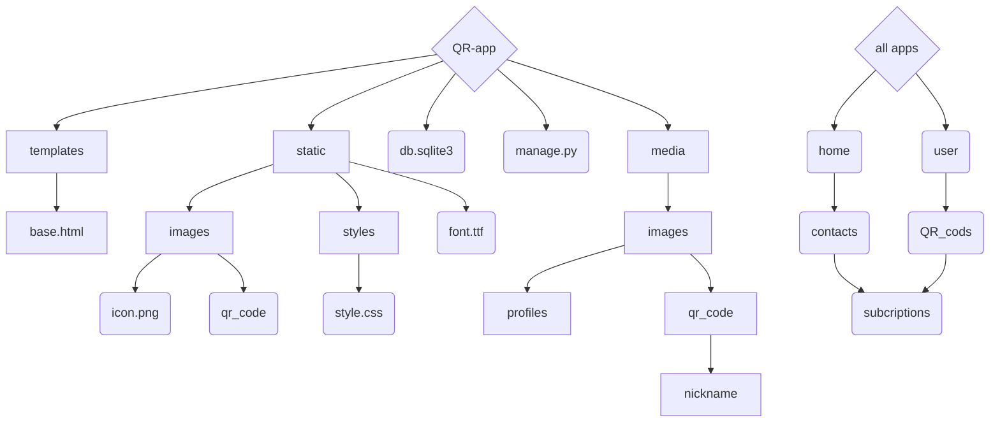
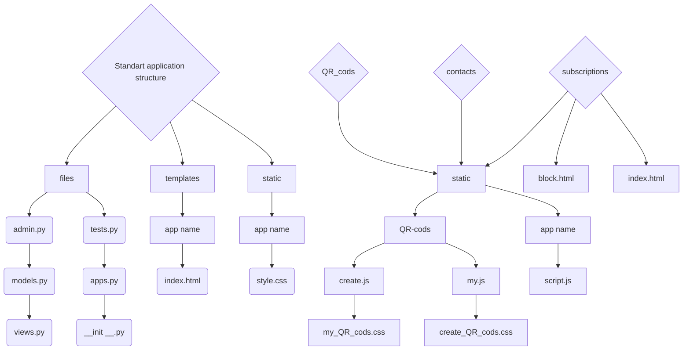

# Сайт для створення Qr кодів / Website for creating Qr codes

<!-- ## Назва проекту: QR приложение / name project: QR app -->

---
### Структура readme:
- [Розробники цього сайту:](#розробники-цього-сайту)
- [Модулі які ми використовували для розробки сайту](#модулі-які-ми-використовували-для-розробки-сайту)
- [Як запустити наш проєкт у роботу](#як-запустити-наш-проєкт-у-роботу)
- [Структура проекту](#структура-проекту--project-sctructure)
- [Структура Приложений](#структура-приложений--apps-sctructure)
- [Описання всіх файлів](#описання-всіх-файлів)
- [Висновок](#висновок)
### Organization readme:
- [Developers of this site:](#developers-of-this-site)
- [we used these modules develop the site](#we-used-these-modules-develop-the-site)
- [How to get our project up and running](#how-to-get-our-project-up-and-running)
- [Project-sctructure](#структура-проекту--project-sctructure)
- [Apps sctructure](#структура-приложений--apps-sctructure)
- [Description of all files](#description-of-all-files)
- [Conclusion](#conclusion)
---

## Developers of this site:
* [Illya Epik](https://github.com/IllyaEpik/online_game.git)
* [Mark popovich](https://github.com/markpopovich9/Qr-app)
* [Renat Belei](https://github.com/Renat19Belei/QR-code-generator)
<!-- - [Сайт для створення Qr кодів / Website for creating Qr codes](#сайт-для-створення-qr-кодів--website-for-creating-qr-codes)
    - [Структура readme:](#структура-readme)
  - [Developers of this site:](#developers-of-this-site)
  - [Розробники цього сайту:](#розробники-цього-сайту)
- [Модулі які ми використовували для розробки сайту](#модулі-які-ми-використовували-для-розробки-сайту)
- [we used these modules develop the site](#we-used-these-modules-develop-the-site)
- [Як запустити наш проєкт у роботу](#як-запустити-наш-проєкт-у-роботу)
- [How to get our project up and running](#how-to-get-our-project-up-and-running) -->
## Розробники цього сайту:
<!-- --- -->
* [Ілля Епік](https://github.com/IllyaEpik/online_game.git)
* [Марк Попович](https://github.com/markpopovich9/Qr-app)
* [Ренат БелеЙ](https://github.com/Renat19Belei/QR-code-generator)

---

## Мета створення проєкту:
 Цей проєкт був створенний для того щоб спростити створення власних QR-кодів для різних потреб користувачів.Він буде корисний як для бізнесу, так і для особистого використання. Завдяки зручному інтерфейсу QR-коди дуже легко створювати, також є багато видів кастомізації.

##  Чим корисний проєкт для користувача?
 Проєкт для створення QR-кодів корисний тим, що спрощує обмін інформацією та підвищує ефективність взаємодії між людьми та бізнесом.
 Завдяки зручному інтефрейсу інтерфейсу QR-коди дуже легко створювати. Також є великий обсяг різної кастомізації.
 Цей проєкт дозволяє швидко, зручно та безпечно передавати інформацію, спрощуючи повсякденні процеси для всіх!

## Детальне пояснення кожного застосунку:

  * home - головна сторінка сайту.
    Мета це забезпечення основної навігації по сайту та загальної інформації.
    Призначення: 
      Відображення головної сторінки.
      Інтеграція з іншими застосунками (контакти, підписки, генерація QR-кодів).
      Обробка запитів користувачів, що заходять на сайт.

  * QR_app – Головний конфігураційний застосунок.
    Мета: Центральний застосунок, який містить налаштування всього проєкту.
    Призначення:
      Налаштування Django (settings.py).
      Опис маршрутів (urls.py).
      Запуск сервера (wsgi.py, asgi.py).
      Підключення бази даних та встановлення глобальних параметрів.

  * QR_codes – Генерація та управління QR-кодами.
    Мета: Генерація QR-кодів для різних даних.
    Призначення:
      Створення QR-кодів.
      Відображення QR-кодів у браузері.
      Збереження QR-кодів у базі даних або файловій системі.
      Інтеграція з контактами (генерація QR-коду для контакту).

## Модулі які ми використовували для розробки сайту:
* Модуль Django
* Модуль io
* Модуль base64 
* Модуль qrcode
* Модуль matplotlib
* Модуль os
* Модуль pillow
## we used these modules develop the site:
* Module Django
* Module io
* Module base64
* Module qrcode
* Module matplotlib
* Module os
* Module pillow

---
### Як запустити наш проєкт у роботу:
* Скачайте проєкт с Github

* Відкрийте термінал та переїдіть у папку QR-app
* Активуйте Віртуальне оточення:
  * Windows
    *  Створює віртуальне оточення : `python -m venv venv`
    *  Активує віртуальне оточення: `venv\Scripts\activate.bat`
  * Mac os:
    * Створює віртуальне оточення : `python3 -m venv venv`
    * `cd venv\bin`
    * Активує віртуальне оточення: `source activate`
    * `cd ../..` 

* Пропишіть цю команду щоб встановити всі необхідні модулі: `pip install Django qrcode matplotlib pillow`
* Після того як скачаете всі необхідні модулі, пропишіть у терміналі `python manage.py runserver`

## How to get our project up and running
- Download the project from Github

* Open the terminal and go to the QR-app folder
* Activate the Virtual Environment:
  * Windows
    * Creates a virtual environment: `python -m venv venv`
    * Activates the virtual environment: `venv\Scripts\activate.bat`
  * Mac OS:
    * Creates a virtual environment: `python3 -m venv venv`
    * `cd venv\bin`
    * Activates the virtual environment: `source activate`
    * `cd ../..` 

* Write this command to install all necessary modules: `pip install Django qrcode matplotlib pillow`
* After downloading all the necessary modules, write `python manage.py runserver` or `python3 manage.py runserver` for mac os in the terminal

---

## Структура проекту / Project sctructure 

## Структура Приложений / apps sctructure 

  <!-- 2  sc -->
  <!-- c  img[images] -->
  <!-- 2  img[images] -->
##

---

# Описання всіх файлів 
  ### Qr_cods/views.py
  --- У цьому файлі ми створюємо функції відображення Qr-codes(render_create_qr_cods, render_my_qr_cods), а також ми створили функцію для створення Qr-codes (create_qr_code)
  ### Qr_cods/urls.py
  --- У ньому ми створюємо url ссилки для сайтуу
  ### QR_cods/tests.py
  --- Цей файл ми не використовували, але ящо ви плануєте використовували він викорстовується для тестів
  ### QR_cods/models.py
  --- У ньому ми створюємо модель QR_CODE
  ### QR_cods/apps.py
  ---Этот файл определяет конфигурацию приложения и используется Django для его инициализации. Также мы создали класс SubscriptionConfig, этот класс описывает конфигурацию приложения Django.
  ### QR_coda/admin.py
  --- використовується для відображення ваших моделей на панелі адміністратора Django
  ### QR_cods/__init__.py
  --- Цей файл ми не використовували
  ### QR_cods/templates/create_QR_cods.html
  --- У цьому файлі ми створюємо сторінку Create QR-codes
  ### QR_cods/templates/my_QR_cods.html
  --- У цьому файлі ми створюємо сторінку My QR-code
  ### QR_cods/static/QR-cods/create_QR_cods.css
  --- У цьому файлі ми задаемо вигляду сторінці Create QR-codes
  ### QR_cods/static/QR-cods/create.js
  --- У ньому ми створюємо "логіку" сторінці Create QR-codes
  ### QR_cods/static/QR-cods/my_QR_cods.css
  --- У цьому файлі ми задаемо вигляду сторінці My QR-codes
  ### QR_cods/static/QR-cods/my.js
  --- У ньому ми створюємо "логіку" сторінці My QR-codes
  ## home/views.py
  --- У цьому файлі ми створюємо функції відображення view_home
  ## home/tests.py
  --- Цей файл ми не використовували, але ящо ви плануєте використовували він викорстовується для тестів
  ## home/models.py
  --- Тут ми нічого не створювали 
  ## home/apps.py
  ---Этот файл определяет конфигурацию приложения и используется Django для его инициализации. Также мы создали класс SubscriptionConfig, этот класс описывает конфигурацию приложения Django.
  ## home/admin.py
  --- використовується для відображення ваших моделей на панелі адміністратора Django
  ## home/init.py
  --- Цей файл ми не використовували
  ## home/templates/index.html
  --- У цьому файлі ми створюємо сторінку home
  ## home/static/home/style.css
  --- У цьому файлі ми задаемо вигляду сторінці home

  ## contacts/views.py
  --- У цьому файлі ми створюємо функції відображення view_contact
  ## contacts/tests.py
  --- Цей файл ми не використовували, але ящо ви плануєте використовували він викорстовується для тестів
  ## contacts/models.py
  --- Тут ми нічого не створювали 
  ## contacts/apps.py
  ---Этот файл определяет конфигурацию приложения и используется Django для его инициализации. Также мы создали класс SubscriptionConfig, этот класс описывает конфигурацию приложения Django.
  ## contacts/admin.py
  --- використовується для відображення ваших моделей на панелі адміністратора Django, але його ми не використовували
  ## contacts/init.py
  --- Цей файл ми не використовували
  ## contacts/templates/contacts/index.html
  --- У цьому файлі ми створюємо сторінку home
  ## contacts/static/contacts/style.css
  --- У цьому файлі ми задаемо вигляду сторінці home

  ## user/views.py
  --- У цьому файлі ми створюємо функції відображення authorization,registration, logout_user
  ## user/admin.py
  --- використовується для відображення ваших моделей на панелі адміністратора Django
  ## user/apps.py
  --- Этот файл определяет конфигурацию приложения и используется Django для его инициализации. Также мы создали класс SubscriptionConfig, этот класс описывает конфигурацию приложения Django.
  ## user/models.py
  --- У цьому файлі ми сворюємо модель Profile
  ## user/tests.py
  --- Цей файл ми не використовували, але ящо ви плануєте використовували він викорстовується для тестів
  ## user/urls.py
  --- У ньому ми створюємо url ссилки для сайту
  ## user/templates/user/authorization.html
  --- У цьому файлі ми створюємо сторінку авторизації
  ## user/templates/user/registration.html
  --- У цьому файлі ми створюємо сторінку регистрации 
  ## user/static/user/style.css
  --- У цьому файлі ми задаемо вигляду сторінці авторизації
  ## user/static/user/style1.css
  ---У цьому файлі ми задаемо вигляду сторінці реєстрації
## /manage.py
--- Файл /manage.py є основним командним сценарієм проекту Django. 
Запускає локальний сервер, виконує міграції бази даних. Це ключовий інструмент для управління проектами Django!
## templates/base.html
---base.html у вашому проекті є базовим шаблоном для всіх сторінок HTML. Який використовується в Django для організації та повторного використання структури веб-сторінок.

## .gitignore
---Файл .gitignore використовується для ігнорування певних файлів і папок під час завантаження проекту в Git.

## db.sqlite3
--Файл db.sqlite3 — це база даних SQLite, яка використовується Django за замовчуванням. Він захищає всі дані вашого проекту (користувачі, записи, моделі). --SQLite — це легка база даних, яка не потребує налаштування сервера, використовується для локальної розробки та тестування.

  
# Description of all files:

  ### subcriptions/views.py
  --- Цей код містить дві функції відображення view_subscription(request:WSGIRequest):, які відповідають за обробку підписок користувачів, а також ми створили функцію redirection(request: WSGIRequest, qr_id): ця функція виконує перенаправлення корис
  ### subscription/apps.py
  --- This file defines the configuration of the application and is used by Django to initialize it. We also made the SubscriptionConfig class, this class describes the configuration of the Django application
  ### subscription/tests.py
  --- We didn`t use this file, but if you plan to use it, then it is used to made for tests.
  ### subscription/models.py
  --- We didn`t use this file in subcription, but if you plan to use it, then it is used to create models. 
  ### subscription/templates
  --- All HTML templates and page structure are located here.
  ### subscription/static 
  --- All static files, styles for html, and Java script are located here.
  ### subscription/static/script.js
  --- In this file we create the logic for our "Subscribe" page.
  ### Qr_codes/views.py
  ------ For this file we have created a function for rendering Qr-codes (render_create_qr_cods, render_my_qr_cods), and we have also created a function for creating Qr-codes (create_qr_code)
  ### Qr_codes/urls.py
  --- We are creating URL links for the site
  ### QR_codes/tests.py
  --- We didn't use this file, but if you plan to use it, it is used for tests.
  ### QR_codes/models.py
  --- In it we create the QR_CODE model
  ### QR_codes/apps.py
  ---This file defines the configuration of the application and is used by Django to initialize itself. We also created the SubscriptionConfig class, this class describes the configuration of the Django application
  ### QR_codes/admin.py
  --- used to display your models in the Django admin panel
  ### QR_cods/ __init__.py
  --- We did not use this file
  ### QR_cods/templates/create_QR_cods.html
  --- In this file we create the Create QR-codes page
  ### QR_cods/templates/my_QR_cods.html
  --- In this file we create the My QR-code page
  ### QR_cods/static/QR-cods/create_QR_cods.css
  --- In this file we set the appearance of the Create QR-codes page
  ### QR_cods/static/QR-cods/create.js
  --- In it we create the "logic" of the Create QR-codes page
  ### QR_cods/static/QR-cods/my_QR_cods.css
  --- In this file we set the appearance of the My QR-codes page
  ### QR_cods/static/QR-cods/my.js
  --- In it we create the "logic" of the My QR-codes page

  ## home/views.py
  --- In this file we create the view_home display functions
  ## home/tests.py
  --- We did not use this file, but if you plan to use it, it is used for tests
  ## home/models.py
  --- We did not create anything here 
  ## home/apps.py
  ---This file defines the application configuration and is used by Django to initialize it. We also created the SubscriptionConfig class, this class describes the Django application configuration.
  ## home/admin.py
  --- used to display your models in the Django admin panel
  ## home/init.py
  --- We did not use this file
  ## home/templates/index.html
  --- In this file we create the home page
  ## home/static/home/style.css
  --- In this file we set the look of the home page
  ## contacts/views.py
  --- In this file we create the view_contact display functions
  ## contacts/tests.py
  --- We did not use this file, but if you plan to use it, it is used for tests
  ## contacts/models.py
  --- We did not create anything here 
  ## contacts/apps.py
  ---This file defines the application configuration and is used by Django to initialize it. We also created the SubscriptionConfig class, this class describes the Django application configuration.
  ## contacts/admin.py
  --- used to display your models in the Django admin panel, but we didn't use it
  ## contacts/init.py
  --- We didn't use this file
  ## contacts/templates/contacts/index.html
  --- In this file we create the home page
  ## contacts/static/contacts/style.css
  --- In this file we set the look of the home page

  ## user/views.py
  --- In this file we create the authorization,registration,logout_user view functions
  ## user/admin.py
  --- used to display your models in the Django admin panel
  ## user/apps.py
  --- This file defines the application configuration and is used by Django to initialize it. We also created the SubscriptionConfig class, this class describes the configuration of the Django application.
  ## user/models.py
  --- In this file we create the Profile model
  ## user/tests.py
  --- We did not use this file, but if you plan to use it, it is used for tests
  ## user/urls.py
  --- In it we create a url link for the site
  ## user/templates/user/authorization.html
  --- In this file we create an authorization page
  ## user/templates/user/registration.html
  --- In this file we create a registration page 
  ## user/static/user/style.css
  --- In this file we set the appearance of the authorization page
  ## user/static/user/style1.css
  --- In this file we set the appearance of the registration page

## templates/base.html
base.html file in your project is the base template for all HTML pages. Which is used in Django to organize and reuse the structure of web pages.

## .gitignore
.gitignore file is used to ignore certain files and folders when uploading a project to Git.

## db.sqlite3
db.sqlite3 file is the SQLite database used by Django by default. It protects all the data of your project (users, records, models). SQLite is a lightweight database that does not require server configuration, used for local development and testing.

## /manage.py
The /manage.py file is the main command script of the Django project. 
Starts the local server, performs migrations database. This is the key tool for Django project management!

---

# Висновок
Отже, у цьому проєкті ми навчилися працювати з Django, створювати та налаштовувати QR-коди, а також ефективно використовувати їх як у звичайному режимі, так і у десктопному. Ми вдосконалили свої навички роботи з медіафайлами, навчились правильно їх обробляти та інтегрувати в проєкт. Окрім цього, ми освоїли методи блокування Qr-codes. А також навчилися робити QR-codes градіентими. Складнощі виникали при створені градіентних QR-codes, а також виникали складнощі при ствоені десктопних QR-codes. Перспективи в цьогу додатку великі, тому що зараз це має попит. В нього ще можна додати одноразові QR-codes, а також зробити так щоб в одному QR-code було декілька ссилок, зробити пароль доя Qr-codes 

# Conclusion
So, in this project we learned how to work with Django, create and configure QR codes, and use them effectively both in normal mode and on desktop devices. We improved our skills in working with media files, learned how to properly process and integrate them into the project. In addition, we mastered methods for blocking Qr-codes. We also learned how to make QR codes with gradients.Difficulties arose when creating gradient QR-codes, and also difficulties arose when creating desktop QR-codes. The prospects for this application are great, because now it is in demand. It is also possible to add disposable QR-codes, as well as make one QR-code have several links, make a password for Qr-codes