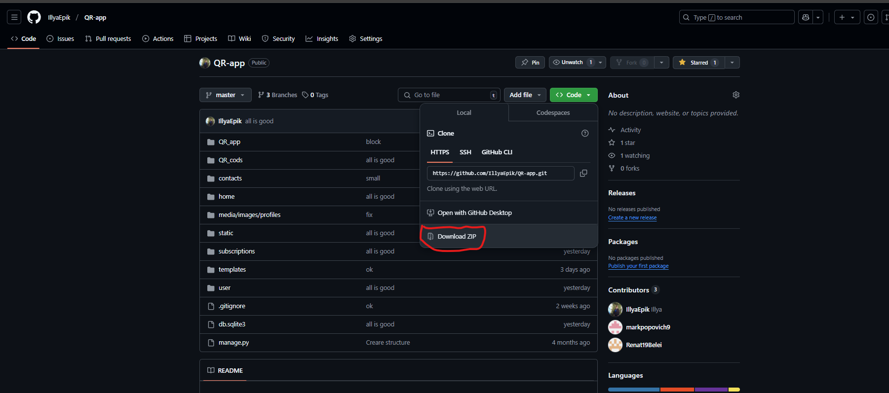

# Сайт для створення Qr кодів / Website for creating Qr codes

<!-- ## Назва проекту: QR приложение / name project: QR app -->

### Структура readme:
---
<!-- - [Сайт для створення Qr кодів / Website for creating Qr codes](#сайт-для-створення-qr-кодів--website-for-creating-qr-codes)
    - [Структура readme:](#структура-readme)
  - [Developers of this site:](#developers-of-this-site) -->
- [Розробники цього сайту:](#розробники-цього-сайту)
- [Модулі які ми використовували для розробки сайту](#модулі-які-ми-використовували-для-розробки-сайту)
<!-- - [we used these modules develop the site](#we-used-these-modules-develop-the-site) -->
- [Як запустити наш проєкт у роботу](#як-запустити-наш-проєкт-у-роботу)
<!-- - [How to get our project up and running](#how-to-get-our-project-up-and-running)эъ -->
### Organization readme:

<!-- --- -->
<!-- 
    - [Структура readme:](#структура-readme) -->
<!-- - [Сайт для створення Qr кодів / Website for creating Qr codes](#сайт-для-створення-qr-кодів--website-for-creating-qr-codes) -->
- [Developers of this site:](#developers-of-this-site)
  <!-- - [Розробники цього сайту:](#розробники-цього-сайту) -->
<!-- - [Модулі які ми використовували для розробки сайту](#модулі-які-ми-використовували-для-розробки-сайту) -->
- [we used these modules develop the site](#we-used-these-modules-develop-the-site)
<!-- - [Як запустити наш проєкт у роботу](#як-запустити-наш-проєкт-у-роботу) -->
- [How to get our project up and running](#how-to-get-our-project-up-and-running)
---
## Developers of this site:
* [Illya Epik](https://github.com/IllyaEpik/online_game.git)
* [Mark popovich](https://github.com/markpopovich9/Qr-app)
* [Renat Belei](https://github.com/Renat19Belei/QR-code-generator)
<!-- - [Сайт для створення Qr кодів / Website for creating Qr codes](#сайт-для-створення-qr-кодів--website-for-creating-qr-codes)
    - [Структура readme:](#структура-readme)
  - [Developers of this site:](#developers-of-this-site)
  - [Розробники цього сайту:](#розробники-цього-сайту)
- [Модулі які ми використовували для розробки сайту](#модулі-які-ми-використовували-для-розробки-сайту)
- [we used these modules develop the site](#we-used-these-modules-develop-the-site)
- [Як запустити наш проєкт у роботу](#як-запустити-наш-проєкт-у-роботу)
- [How to get our project up and running](#how-to-get-our-project-up-and-running) -->
## Розробники цього сайту:
<!-- --- -->
* [Ілля Епік](https://github.com/IllyaEpik/online_game.git)
* [Марк Попович](https://github.com/markpopovich9/Qr-app)
* [Ренат БелеЙ](https://github.com/Renat19Belei/QR-code-generator)

---
## Модулі які ми використовували для розробки сайту:
* Модуль Django
* Модуль io
* Модуль base64 
* Модуль qrcode
* Модуль matplotlib
* Модуль os
* Модуль pillow
## we used these modules develop the site:
* Module Django
* Module io
* Module base64
* Module qrcode
* Module matplotlib
* Module os
* Module pillow

---
### Як запустити наш проєкт у роботу:
* Скачайте проєкт с Github

* Відкрийте термінал та переїдіть у папку QR-app
* Активуйте Віртуальне оточення:
  * Windows
    *  Створює віртуальне оточення : `python -m venv venv`
    *  Активує віртуальне оточення: `venv\Scripts\activate.bat`
  * Mac os:
    * Створює віртуальне оточення : `python3 -m venv venv`
    * `cd venv\bin`
    * Активує віртуальне оточення: `source activate`
    * `cd ../..` 

* Пропишіть цю команду щоб встановити всі необхідні модулі: `pip install Django qrcode matplotlib pillow`
* Після того як скачаете всі необхідні модулі, пропишіть у терміналі `python manage.py runserver`

## How to get our project up and running
Download the project from Github

* Open the terminal and go to the QR-app folder
* Activate the Virtual Environment:
  * Windows
    * Creates a virtual environment: `python -m venv venv`
    * Activates the virtual environment: `venv\Scripts\activate.bat`
  *Mac OS:
    * Creates a virtual environment: `python3 -m venv venv`
    * `cd venv\bin`
    * Activates the virtual environment: `source activate`
    * `cd ../..` 

* Write this command to install all necessary modules: `pip install Django qrcode matplotlib pillow`
* After downloading all the necessary modules, write `python manage.py runserver` or `python3 manage.py runserver` for mac os in the terminal

